# Omnidirectional Robot Odometry
Omnidirectional 4-wheels mobile robot odometry implementation in ROS (C++) as "Robotics" course project 2022, Politecnico di Milano.

Real Robot                 |  Robot Scheme
:-------------------------:|:-------------------------:
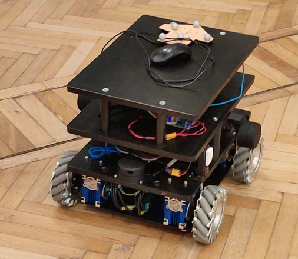          |  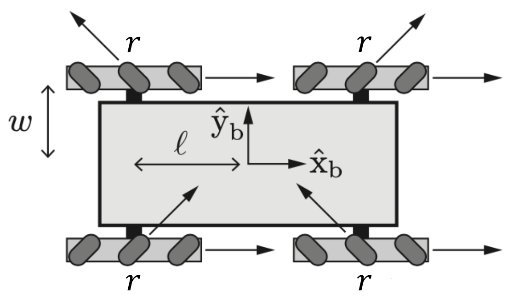

## 1. Authors
- Alessandro Restifo, 10608696
- Mirko Usuelli, 10570238

## 2. Archive files descriptions
```
omni-robot/
.
├── bags_new
|   ├── bag1
|   |   ├── robot-pose.csv
|   |   └── wheel_states.csv
│   ├── bag2
|   |   ├── robot-pose.csv
|   |   └── wheel_states.csv
│   ├── bag3
|   |   ├── robot-pose.csv
|   |   └── wheel_states.csv
│   ├── bag1.bag
│   ├── bag2.bag
│   └── bag3.bag
├── bags_old
|   ├── bag1.bag
│   ├── bag2.bag
│   └── bag3.bag
├── cfg
│   └── parameters.cfg
├── CMakeLists.txt
├── config
│   └── omni_robot.yaml
├── doc
│   └── Project1.pdf
├── img
├── include
│   └── omni-robot
│       ├── omni_model.h
│       └── omni_tester.h
├── launch
│   └── omni-robot.launch
├── msg
│   └── omni_msg.msg
├── package.xml
├── README.md
├── script
│   ├── params_GA_tuning.ipynb
│   └── plot_result.py
├── src
│   ├── omni_model.cpp
│   ├── omni_model_node.cpp
│   ├── omni_reset.cpp
│   ├── omni_tester.cpp
│   └── omni_tester_node.cpp
└── srv
    └── omni_reset.srv
```

- In bags_new are the latest bags uploaded, while in bags_old are the initial (corrupted) bags.

- In config are the optimized parameters of the robot, found with the GA optimizer.

- In launch, there is the launch file, which also includes the world initialization of the robot odometry frame!
The initialization is currently for the bag3 bag!

- The source code has two main nodes, omni_model and omni_tester.
The first node includes the logic which computes the odometry of the robot, both via Euler and via Runge-Kutta formulas (better explained in section 7).
The latter is a debug node, built to update the user of the chosen parameters and of the odometry computed in the first node.

- In msg is the ROS message required to publish the computed wheel velocities.

- In script is the Python script used to optimize the robot parameters.


## 3. Names and meaning of the ROS parameters
// TODO: chiedere a cudrano

## 4. TF tree structure
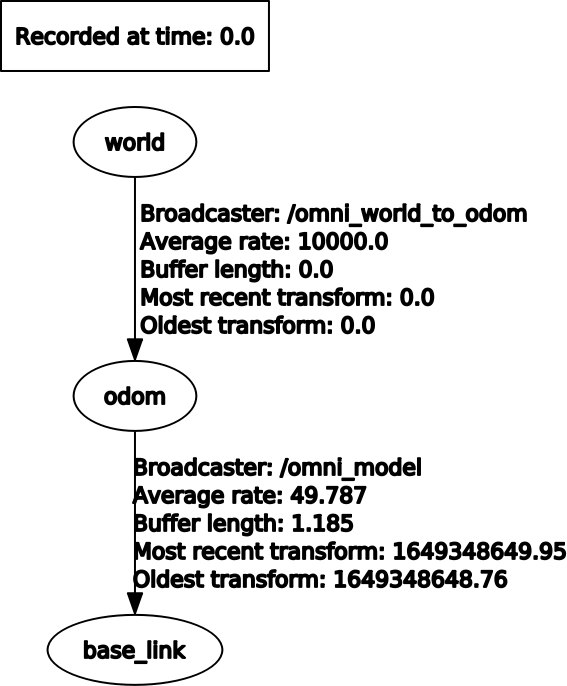

## 5. Custom messages
- omni_msg.msg : used to publish rpm wheels information for second task (which will be subscribed by the second node "omni_tester")
```
    Header header
    float64 rpm_fl
    float64 rpm_fr
    float64 rpm_rr
    float64 rpm_rl
```

## 6. Instructions to use the code
- Insert the ROS packages by typing:
```
  $ mv omni-robot <path>/catkin_ws/src
```
- Go to your own *catkin_ws* folder in the system and recompile everything by doing:
```
  $ cd <path>/catkin_ws
  $ source ./devel/setup.bash
  $ catkin_make
```
- Then run `ROS core` by typing:
```
  $ roscore
```
- Open a new terminal and launch the robot simulation as:
```
  $ cd <path>/catkin_ws
  $ source ./devel/setup.bash
  $ roslaunch omni-robot omni-robot.launch
```
### (I) Compute Odometry
- Open one terminal and start rviz:
```
  $ rosrun rviz rviz
```
- Launch the launch file:
```
  $ roslaunch omni_robot omni_robot.launch
```
- Execute a bag file:
```
  $ rosbag play <bag_file>.bag
```
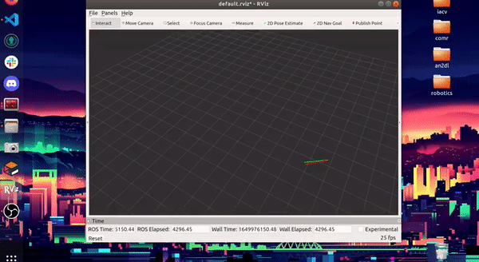

### (II) Compute Control
- Open one terminal and start plotjugger:
```
  $ rosrun plotjuggler plotjuggler
```
- Launch the launch file:
```
  $ roslaunch omni_robot omni_robot.launch
```
- Execute a bag file:
```
  $ rosbag play <bag_file>.bag
```
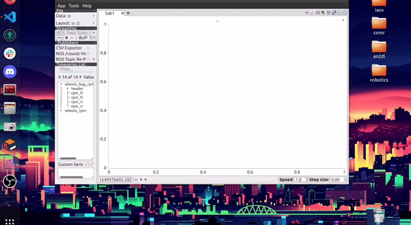

### (III) Reset Service
- Launch the launch file:
```
  $ roslaunch omni_robot omni_robot.launch
```
- Execute a bag file:
```
  $ rosbag play <bag_file>.bag
```
- Open another terminal and whenever you want type, for instance x=0, y=0, theta=0:
```
  $ rosservice call /reset 0 0 0
```
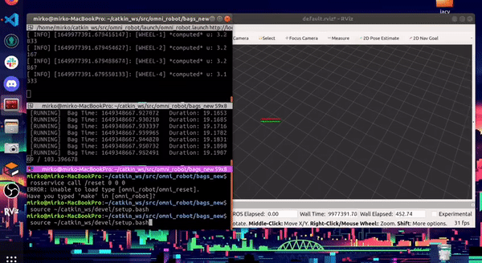

### (IV) Dynamic Configuration for the Integration Method
- Launch the launch file:
```
  $ roslaunch omni_robot omni_robot.launch
```
- Open one terminal and start rqt_configure:
```
  $ rosrun rqt_reconfigure rqt_reconfigure
```
- Execute a bag file:
```
  $ rosbag play <bag_file>.bag
```
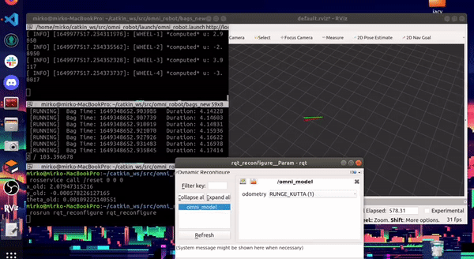

## 7. Further info - Genetic Algorithm based robot parameters optimization
Goal 1.4 of the project is specified as a calibration (fine-tuning) of the robot parameters to match the OptiTrack trajectory, used as ground-truth data.
To achieve this goal limiting the human intervention as much as possible, a Genetic Algorithm space search strategy has been used.

The short script is implemented in python and is stored under /scripts/Param_GA_tuning.ipynb.
Following is the evolutionary process of the trajectories, generated with the best solutions (robot parameters) of each epoch, from 1st to 200th generation:

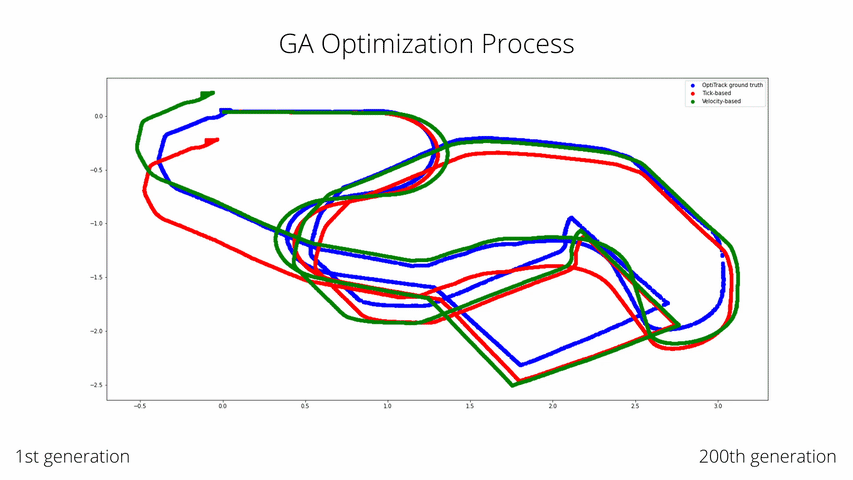

### Requirements to run the script

Packages to install:
```
python 3.9
tqdm
bagpy
pygad
numpy
pandas
matplotlib
```

Moreover the script must be extracted to the base folder.


### Broad description

Reading the provided bags with bagpy and pandas has been the first step in the process.

Once the bags are loaded in memory, the logic implemented in ROS (C++) for the trajectory computation has been replicated in the python code to generate the complete trajectories.

The trajectories are computed both using the encoder ticks and directly using the motor velocity, converted through the gear ratio to the wheel angular velocity.

Once the wheel velocity is known, the vehicle velocity is estimated and integrated via Euler and Runge-Kutta methods to estimate the movement and, eventually, the whole trajectory.

Here are the trajectories computed with the default robot parameters found in the project slides:

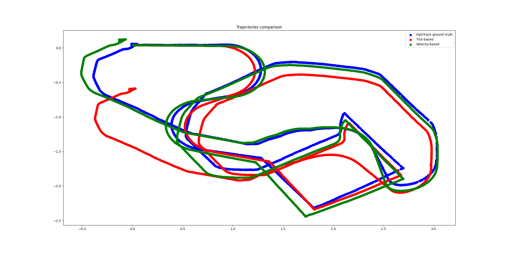


### Optimization process description

In order to employ the genetic algorithm optimization process, a fitness function is needed.

We start by defining a loss function, which is later inverted to get the fitness value.

The loss function is made of 3 different components:

1. most important, the average distance between the ticks(encoder)-based trajectory and the OptiTrack ground truth trajectory
2. the average distance between the velocity-based trajectory and the ground truth trajectory
3. a regularization loss, which is the relative distance between the default values and the values found as solution by the optimization process

Component (1) is necessary, as it allows to optimize the parameters s.t. the resulting trajectory is closest to the ground truth.
It represents the objective given in the project specification.

Component (2) is not explicitly specified in the project. That being said, optimizing the velocity trajectory (already fairly correct with the default parameters) acts as a form of regularization on the optimization process.
Moreover, globally optimizing the two trajectories may reflect a more accurate way of finding the global optima and the best robot parameters, as the velocity-based trajectory only depends on <r,l,w>, while the ticks-based trajectory also depends on the parameter N.

In order to compute the average distance between two trajectories, n (n=500) different evenly spaced points are selected from the ground truth trajectory.
After the selection, we search and select their closest point in the odometry trajectory. Their distance is averaged with all the other points in order to define the loss.
Although this process might be noisy, due to the fact that we might be computing the distance of the "wrong" pair of points (the robot parameters and hence the trajectories are randomly initialized), the alternative of selecting the "right" pair of points based on their timestamps was not feasible.
Indeed, the optitrack trajectory presents some "jolts" and errors as well, which do not guarantee the selection of the "right" pair.
Furthermore, computing the distances from the closest points of the odometry-based trajectory still performed very well, thanks to components (2) and (3).

Last, component (3) represents a regularization factor which should constrain the optimization process around the default parameters, striking a balance between the breadth of the search in the space and the original values. Following is the grap of the fitness function:

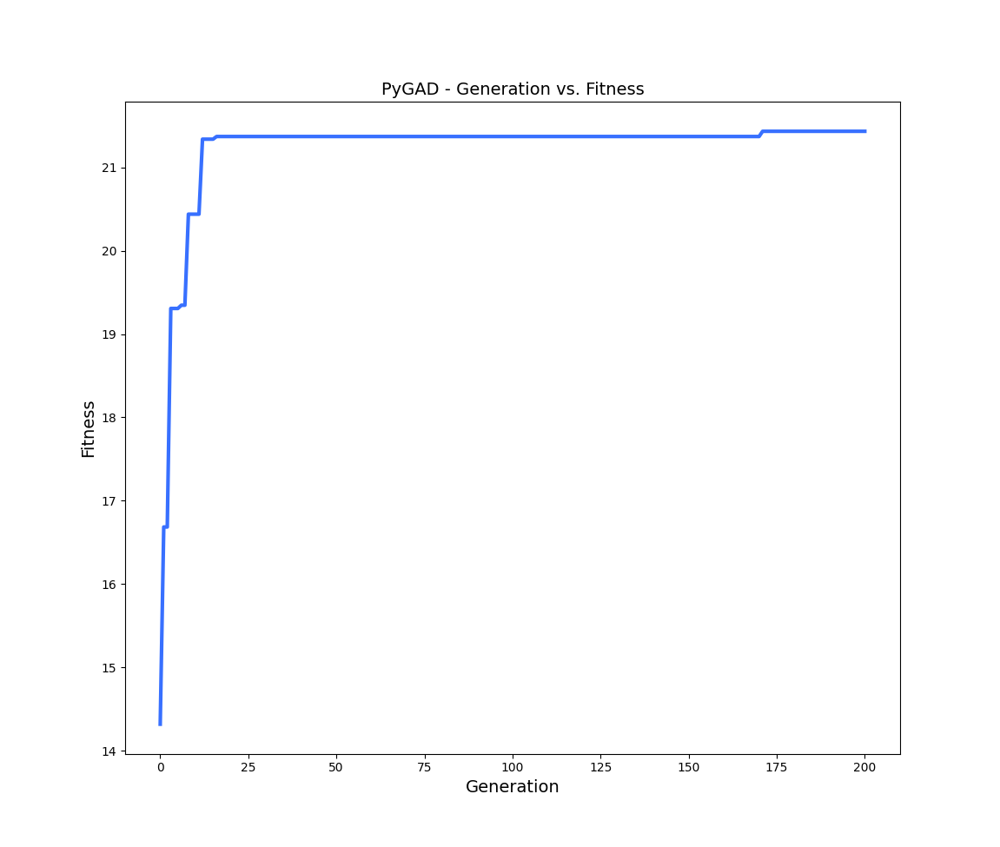

Thanks to the joint trajectory optimization, we show that the regularization component is not strictly necessary in the optimization process, as expected.
The velocity-based joint trajectory optimization already performs the needed regularization, obtaining very close trajectories and parameters to the ones found with the regularization loss.

In order to keep the parameters as close as possible to the original ones, we still keep the regularization loss in the final delivery.

Here are the trajectories computed with the delivered, optimized, parameters:

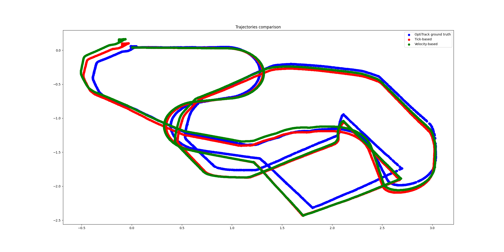
